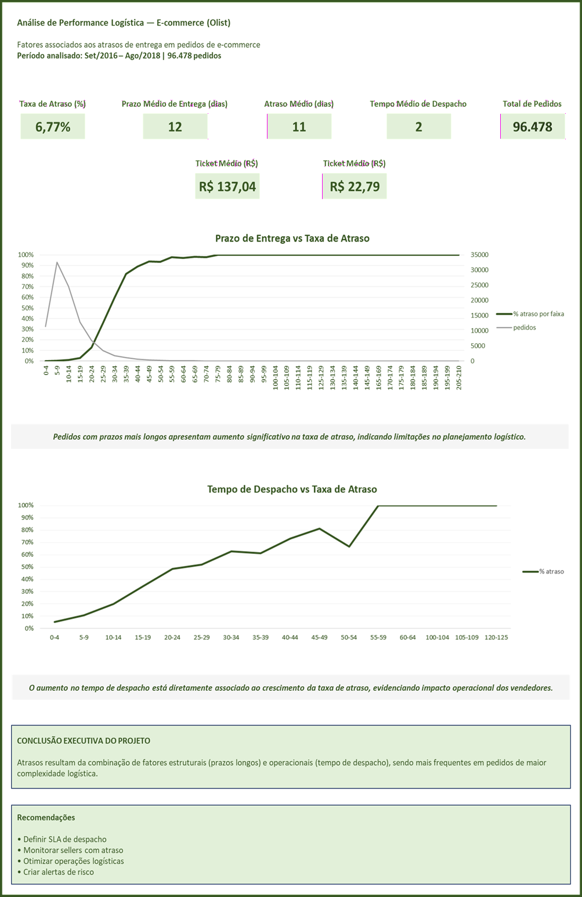
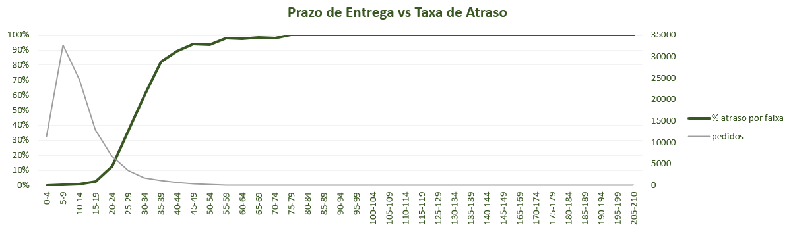
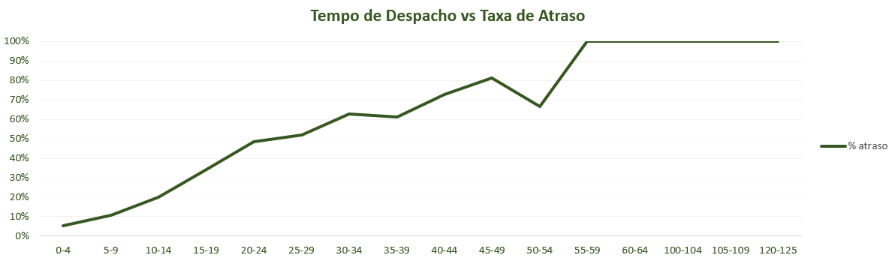

# 📊 Análise de logística de comércio eletrônico (OLIST)

## 📌 Contexto

Este projeto analisa o desempenho logístico de entregas em um marketplace brasileiro, com foco na identificação de fatores que contribuem para atrasos nos pedidos.

---

## 🎯 Problema de Negócio

Uma parcela relevante dos pedidos apresenta atraso na entrega (~6,77%), impactando diretamente a experiência do cliente e a eficiência operacional do negócio.

---

## 🎯 Objetivo

Investigar os principais fatores associados aos atrasos logísticos e identificar oportunidades práticas de melhoria na operação.

---

## 📂 Dataset

Olist E-commerce Dataset (Kaggle), contendo informações de pedidos, clientes, vendedores, produtos e entregas.

---

## 📏 Métricas Utilizadas

- Taxa de atraso (%)
- Prazo médio de entrega (dias)
- Atraso médio (dias)
- Tempo médio de despacho (dias)
- Ticket médio (R$)
- Frete médio (R$)
- Volume de pedidos

---

## 📊 Dashboard

---

## 📈 Análises

### Prazo vs Atraso

### Despacho vs Atraso

---

## 💡 Principais Insights

- Pedidos com prazos mais longos apresentam maior taxa de atraso, indicando limitações no planejamento logístico.
- O tempo de despacho dos vendedores tem impacto direto no atraso, evidenciando falhas operacionais no envio.
- Pedidos com maior valor de frete apresentam maior risco de atraso, sugerindo maior complexidade logística nessas entregas.
- Os atrasos são resultado da combinação de fatores estruturais e operacionais ao longo da cadeia de entrega.

---

## 🚀 Recomendações

### Curto prazo
- Definir SLA de despacho (ex: até 2 dias)
- Monitorar vendedores com atraso recorrente
- Criar alertas para pedidos com alto risco de atraso

### Médio prazo
- Otimizar rotas logísticas
- Revisar prazos prometidos ao cliente
- Priorizar pedidos com maior prazo de entrega

### Longo prazo
- Estruturar centros de distribuição regionais
- Desenvolver estratégia logística por região

---

## ⚠️ Qualidade dos Dados

Foram identificadas pequenas inconsistências na base, como registros com tempo de despacho negativo e alguns pedidos sem data de entrega válida.

Esses casos foram tratados ou desconsiderados em análises específicas, garantindo a consistência dos resultados apresentados.

---

## 🧾 Conclusão

Os atrasos logísticos resultam da combinação de fatores estruturais (prazos longos) e operacionais (tempo de despacho).

Pedidos mais complexos, indicados por fretes mais altos, apresentam maior risco de atraso.

Esses fatores elevam o risco operacional e impactam diretamente a experiência do cliente.
